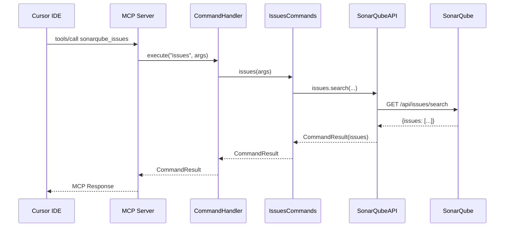

# 🔍 SonarQube MCP - Model Context Provider

[](https://www.python.org/downloads/)
[](https://github.com/psf/black)
[](LICENSE)
[](docs/)

**Connecteur Python modulaire et professionnel pour intégrer SonarQube dans les IDEs alimentés par l'IA via le Model Context Protocol (MCP).**

## 📋 Table des matières

- [Fonctionnalités](#-fonctionnalités)
- [Architecture](#-architecture)
- [Installation](#-installation)
- [Configuration](#️-configuration)
- [Utilisation](#-utilisation)
- [Commandes disponibles](#-commandes-disponibles)
- [Intégration IDE](#-intégration-ide)
- [Tests](#-tests)
- [Développement](#-développement)
- [Documentation](#-documentation)

## 🚀 Démarrage rapide

- **Nouveau ?** → [QUICK_START.md](docs/QUICK_START.md) - Démarrage en 3 étapes
- **Installation complète** → [INSTALLATION.md](docs/INSTALLATION.md) - Guide pas à pas
- **Utilisation depuis un projet** → [GUIDE_UTILISATION.md](docs/GUIDE_UTILISATION.md) - Guide complet

## ✨ Fonctionnalités

### 🎯 Couverture API complète

- **Issues** : Recherche, filtrage, historique, assignation
- **Métriques** : Qualité du code, couverture, complexité
- **Sécurité** : Hotspots, vulnérabilités
- **Projets** : Liste des projets, informations, Quality Gates
- **Règles** : Détails, recherche
- **Utilisateurs** : Recherche, assignations

### 🚀 Caractéristiques techniques

- ✅ Architecture modulaire et maintenable
- ✅ Gestion d'erreurs robuste avec retry logic
- ✅ Support multi-projets
- ✅ Configuration flexible (env, YAML)
- ✅ Tests unitaires et d'intégration (250 tests, 87% coverage)
- ✅ Type hints et docstrings
- ✅ Logging détaillé
- ✅ CLI et serveur MCP

### 🎨 Commandes raccourcies

- `mine` : Mes issues du projet par défaut
- `bugs` : Tous les bugs d'un projet
- `vulnerabilities` : Toutes les vulnérabilités
- `code-smells` : Tous les code smells

## 🏗️ Architecture

### Diagramme d'architecture

```mermaid
graph TB
    User[👤 Utilisateur Cursor] --> MCP[🔌 MCP Server]
    MCP --> CH[⚙️ CommandHandler]
    CH --> IC[📋 IssuesCommands]
    CH --> MC[📊 MeasuresCommands]
    CH --> SC[🔒 SecurityCommands]
    CH --> PC[📁 ProjectsCommands]
    IC --> API[🌐 SonarQubeAPI]
    MC --> API
    SC --> API
    PC --> API
    API --> IA[Issues API]
    API --> MA[Measures API]
    API --> SA[Security API]
    API --> PA[Projects API]
    IA --> SQ[☁️ SonarQube Server]
    MA --> SQ
    SA --> SQ
    PA --> SQ
    
    style User fill:#e1f5ff
    style MCP fill:#fff3cd
    style CH fill:#d4edda
    style API fill:#f8d7da
    style SQ fill:#d6d8db
```



### Diagramme de flux



### Structure du projet

```
SonarQubeMCP/
├── src/
│   ├── api/                  # Client API modulaire
│   │   ├── base.py           # Classe de base
│   │   ├── issues.py         # Endpoints Issues
│   │   ├── measures.py       # Endpoints Measures
│   │   ├── security.py       # Endpoints Security
│   │   ├── projects.py       # Endpoints Projects
│   │   ├── users.py          # Endpoints Users
│   │   └── rules.py          # Endpoints Rules
│   ├── commands/             # Commandes modulaires
│   │   ├── base.py           # Classes de base
│   │   ├── issues.py         # Commandes Issues
│   │   ├── measures.py       # Commandes Measures
│   │   ├── security.py       # Commandes Security
│   │   ├── projects.py       # Commandes Projects
│   │   └── users.py          # Commandes Users & Rules
│   ├── config.py             # Configuration centralisée
│   ├── models.py             # Modèles de données
│   └── utils.py              # Utilitaires de validation
├── tests/                    # Tests unitaires et d'intégration
├── docs/                     # Documentation
├── examples/                 # Exemples d'utilisation
├── scripts/                  # Scripts utilitaires
├── sonarqube_mcp_server.py   # Serveur MCP
├── sonarqube_cli.py          # Interface CLI
└── requirements.txt          # Dépendances Python
```

## 🚀 Installation

### Prérequis

- Python 3.8 ou supérieur
- pip
- Accès à un serveur SonarQube
- Token d'authentification SonarQube

### Installation standard

```bash
# Cloner le repository
git clone https://github.com/SEPTEO-OPENSOURCE/MCP_SonarQube.git
cd MCP_SonarQube

# Créer un environnement virtuel
python3 -m venv venv
source venv/bin/activate  # Sur Windows: venv\Scripts\activate

# Installer les dépendances
pip install -r requirements.txt
```

### Installation pour développement

```bash
# Installer avec les dépendances de développement
pip install -r requirements.txt

# Installer en mode éditable
pip install -e .
```

## ⚙️ Configuration

### Variables d'environnement (Recommandé)

> ⚠️ **Changement depuis v4.0:** SONARQUBE_URL est maintenant obligatoire.
> Ajoutez-le à votre ~/.zshrc: `export SONARQUBE_URL="https://votre-server.com"`

```bash
# Configuration minimale requise
export SONARQUBE_URL="https://sonarqube.example.com"
export SONARQUBE_TOKEN="votre_token_ici"

# Configuration optionnelle
export SONARQUBE_PROJECT_KEY="MyProject"  # Projet par défaut
export SONARQUBE_USER="votre-login"       # Utilisateur par défaut (assignee)
export SONARQUBE_TIMEOUT="30"
export SONARQUBE_MAX_RETRIES="3"
export SONARQUBE_PAGE_SIZE="500"

# Configuration du logging (optionnel)
export SONARQUBE_LOG_DIR="~/.sonarqube_mcp/logs"     # Dossier des logs (défaut: ~/.sonarqube_mcp/logs)
export SONARQUBE_LOG_LEVEL="INFO"                     # Niveau de log: DEBUG, INFO, WARNING, ERROR (défaut: INFO)
```

### Fichier de configuration YAML

Copiez `config.yaml.example` vers `config.yaml` et adaptez :

```yaml
url: "https://sonarqube.example.com"
timeout: 30
max_retries: 3
page_size: 500

default_project:
  key: "MyProject"
  name: "My Application"
  branch: "main"
  assignee: "developer-user"

projects:
  - key: "Project1"
    name: "Project 1"
  - key: "Project2"
    name: "Project 2"
```

### Configuration dans ~/.zshrc ou ~/.bashrc

```bash
# Ajouter à ~/.zshrc ou ~/.bashrc
echo 'export SONARQUBE_URL="https://sonarqube.example.com"' >> ~/.zshrc
echo 'export SONARQUBE_TOKEN="votre_token_ici"' >> ~/.zshrc
echo 'export SONARQUBE_PROJECT_KEY="MyProject"' >> ~/.zshrc
echo 'export SONARQUBE_USER="votre-login"' >> ~/.zshrc
source ~/.zshrc
```

## 💻 Utilisation

### Interface CLI

```bash
# MES issues assignées (comportement par défaut)
# Utilise automatiquement SONARQUBE_PROJECT_KEY et SONARQUBE_USER
python3 sonarqube_cli.py issues

# TOUTES les issues d'un projet spécifique
python3 sonarqube_cli.py issues MyProject

# Issues assignées à un utilisateur spécifique
python3 sonarqube_cli.py issues MyProject developer-user

# Issues filtrées par fichier
python3 sonarqube_cli.py issues MyProject developer-user lib/main.dart

# Alias disponible (identique à "issues" sans paramètre)
python3 sonarqube_cli.py my-issues

# Métriques d'un projet
python3 sonarqube_cli.py measures MyProject

# Hotspots de sécurité
python3 sonarqube_cli.py hotspots MyProject

# Issues par sévérité
python3 sonarqube_cli.py issues-by-severity MyProject CRITICAL

# Tous les bugs
python3 sonarqube_cli.py bugs MyProject

# Détails d'une règle
python3 sonarqube_cli.py rule dart:S1192

# Rechercher des utilisateurs
python3 sonarqube_cli.py users john.doe

# Afficher l'aide
python3 sonarqube_cli.py help
```

### Serveur MCP

Le serveur MCP s'exécute en mode stdio pour l'intégration avec les IDEs :

```bash
# Lancer le serveur MCP
python3 sonarqube_mcp_server.py
```

Le serveur lit les requêtes JSON depuis stdin et écrit les réponses sur stdout, conformément au protocole MCP.

## 📚 Commandes disponibles

### Issues

| Commande | Description                                               | Usage                                         |
|----------|-----------------------------------------------------------|-----------------------------------------------|
| `issues` | Liste les issues ou l'on est assigné d'un projet          | `issues <project_key> [file_path]`            |
| `search-issues` | Liste les issues d'un projet avec des filtres spécifiques | `issues <project_key> [assignee] [statuses]`          |
| `my-issues` | VOS issues (100% automatique)                             | `my-issues`                                   |
| `mine` | Raccourci pour VOS issues                                 | `mine`                                        |
| `issue-changelog` | Historique d'une issue                                    | `issue-changelog <issue_key>`                 |
| `issues-by-type` | Filtrer par type                                          | `issues-by-type <project_key> <type>`         |
| `issues-by-severity` | Filtrer par sévérité                                      | `issues-by-severity <project_key> <severity>` |
| `bugs` | Tous les bugs                                             | `bugs [project_key]`                          |
| `vulnerabilities` | Toutes les vulnérabilités                                 | `vulnerabilities [project_key]`               |
| `code-smells` | Tous les code smells                                      | `code-smells [project_key]`                   |

**Types disponibles** : `BUG`, `VULNERABILITY`, `CODE_SMELL`, `SECURITY_HOTSPOT`  
**Sévérités disponibles** : `BLOCKER`, `CRITICAL`, `MAJOR`, `MINOR`, `INFO`
**Status disponibles** : `OPEN`, `CONFIRMED`, `FALSE_POSITIVE`, `ACCEPTED`, `FIXED`, `IN_SANDBOX`) 

> ⚠️ **Important** : Les commandes `my-issues` et `mine` requièrent que SONARQUBE_PROJECT_KEY et SONARQUBE_USER soient définis dans votre environnement. Voir [Configuration](#️-configuration).

### Métriques

| Commande | Description | Usage |
|----------|-------------|-------|
| `measures` | Métriques d'un projet | `measures <project_key> [metrics]` |
| `metrics` | Alias de measures | `metrics <project_key> [metrics]` |

**Métriques disponibles** : `ncloc`, `coverage`, `bugs`, `vulnerabilities`, `code_smells`, `security_hotspots`, `duplicated_lines_density`, `reliability_rating`, `security_rating`, `sqale_rating`

### Sécurité

| Commande | Description | Usage |
|----------|-------------|-------|
| `hotspots` | Hotspots de sécurité | `hotspots <project_key> [status]` |
| `security-hotspots` | Alias de hotspots | `security-hotspots <project_key>` |

**Status disponibles** : `TO_REVIEW`, `REVIEWED`, `SAFE`

### Projets

| Commande | Description | Usage |
|----------|-------------|-------|
| `project-info` | Informations d'un projet | `project-info <project_key>` |
| `projects` | Liste des projets | `projects [search_term]` |
| `quality-gate` | Statut du Quality Gate | `quality-gate <project_key>` |

### Utilisateurs & Règles

| Commande | Description | Usage |
|----------|-------------|-------|
| `users` | Rechercher des utilisateurs | `users <search_term>` |
| `rule` | Détails d'une règle | `rule <rule_key>` |
| `rules` | Rechercher des règles | `rules [search_term]` |

### Système

| Commande | Description | Usage |
|----------|-------------|-------|
| `health` | Santé du serveur | `health` |
| `version` | Version du serveur | `version` |
| `help` | Afficher l'aide | `help [command]` |

## ✅ MCP visible dans Cursor

Une fois configuré, le serveur MCP SonarQube expose **14 outils** visibles dans :
- Cursor Settings > Tools & MCP
- "sonarqube : 14 tools, 1 resource enabled"

Ces outils permettent à l'assistant Cursor de :
- Récupérer VOS issues automatiquement (sonarqube_issues)
- Analyser les métriques de qualité
- Consulter les hotspots de sécurité
- Et plus encore...

**Aucune installation ou script externe requis.**

## 🔗 Intégration IDE

### Configuration pour Cursor

#### Étape 1 : Configurer les variables d'environnement dans ~/.zshrc

Les variables sensibles et spécifiques au projet doivent être définies dans votre shell :

```bash
# Ouvrir ~/.zshrc
nano ~/.zshrc

# Ajouter ces lignes
export SONARQUBE_URL="https://sonarqube.example.com"
export SONARQUBE_TOKEN="votre_token_ici"
export SONARQUBE_PROJECT_KEY="MyProject"  # Optionnel : projet par défaut

# Recharger
source ~/.zshrc
```

#### Étape 2 : Configurer Cursor MCP

Ajoutez cette configuration dans `~/.cursor/mcp.json` :

```json
{
  "mcpServers": {
    "sonarqube": {
      "command": "/chemin/vers/venv/bin/python",
      "args": [
        "/chemin/vers/SonarQubeMCP/sonarqube_mcp_server.py"
      ],
      "env": {
        "SONARQUBE_QUALITY_AUDIENCE": "assistant",
        "SONARQUBE_QUALITY_PRIORITY": "0.8",
        "SONARQUBE_SECURITY_AUDIENCE": "assistant",
        "SONARQUBE_SECURITY_PRIORITY": "0.9",
        "SONARQUBE_METADATA_ENABLED": "true"
      },
      "capabilities": {
        "resources": {
          "subscribe": true,
          "listChanged": true
        }
      }
    }
  }
}
```

**✅ Avantages de cette approche** :
- Les variables sensibles (`SONARQUBE_URL`, `SONARQUBE_TOKEN`, `SONARQUBE_PROJECT_KEY`) sont dans le shell
- La config Cursor reste générique et réutilisable
- Changement de projet facile en modifiant uniquement `~/.zshrc`
- Pas de secrets dans les fichiers de configuration

### Utilisation dans Cursor

Une fois configuré, vous pouvez demander à l'assistant :

```
"Montre-moi mes issues SonarQube assignées"
"Quelles sont les métriques du projet MyProject ?"
"Liste les hotspots de sécurité du projet"
"Explique-moi la règle dart:S1192"
```

L'assistant utilisera automatiquement le MCP SonarQube pour répondre.

## 🔒 Sécurité

### Sécurité des Logs

Les tokens et credentials sont automatiquement masqués dans les logs pour garantir la sécurité en production.

**Patterns masqués automatiquement** :
- Tokens SonarQube (format `squ_*`)
- Bearer tokens
- API keys
- Passwords
- Headers d'autorisation

**Exemple** :
```
# Log original (dangereux)
Authenticating with token=squ_abc123def456...

# Log masqué (sécurisé)
Authenticating with token: ***MASKED***
```

**Configuration** :
```bash
# Mode DEBUG safe pour production
export SONARQUBE_LOG_LEVEL="DEBUG"  # Les tokens seront toujours masqués
```

Le filtrage est appliqué automatiquement à tous les handlers de logging, y compris les logs dans les fichiers et stderr. Aucune configuration supplémentaire nécessaire.

## 🧪 Tests

### Exécuter les tests

```bash
# Tous les tests
pytest

# Tests avec couverture
pytest --cov=src --cov-report=html

# Tests spécifiques
pytest tests/test_config.py
pytest tests/test_api.py -v

# Tests avec logs détaillés
pytest -v --log-cli-level=DEBUG
```

### Couverture de tests

**Statut actuel** : 250 tests (100% passent), couverture globale **87%** ✅

Nouveaux outils v4.0.0 (depuis Octobre 2025) :
- ✅ `sonarqube_analyses_history` - Historique des analyses
- ✅ `sonarqube_duplications` - Duplications de code
- ✅ `sonarqube_source_lines` - Code source annoté
- ✅ `sonarqube_metrics_list` - Liste des métriques
- ✅ `sonarqube_languages` - Langages supportés
- ✅ `sonarqube_projects` - Liste des projets disponibles

### Tests de compatibilité Windows

**Test de compatibilité cross-platform** :
```bash
# Vérifier la compatibilité Windows (signal.SIGALRM → threading)
python tests\integration\test_windows_fix.py
```

Ce test vérifie que :
- ✅ Le module `signal.SIGALRM` (Unix uniquement) a été remplacé par `threading.Thread`
- ✅ Le serveur MCP peut s'importer sans erreur sur Windows
- ✅ Le timeout de 60 secondes fonctionne de manière cross-platform

**Contexte** : Le module `signal` avec `SIGALRM` n'existe pas sur Windows. Le projet utilise maintenant `threading.Thread` avec `join(timeout=60)` pour gérer les timeouts de manière compatible avec tous les systèmes d'exploitation.

Modules avec excellente couverture :
- ✅ `src/models.py` : 100%
- ✅ `src/commands/projects.py` : 100%
- ✅ `src/commands/measures.py` : 100%
- ✅ `src/api/measures.py` : 100%
- ✅ `src/utils.py` : 100% (validation & sécurité)
- ✅ `src/mcp/tools_registry.py` : 87%
- ✅ `src/mcp/server.py` : 71% (tests d'intégration)

Modules en cours d'amélioration :
- ⚠️ `src/api/*` : 29-57% → objectif 75%
- ⚠️ `src/commands/*` : 15-52% → objectif 70%
- ⚠️ `src/config.py` : 52% → objectif 80%

**Note** : Tous les tests passent (84/84 ✅). L'amélioration de la couverture est en cours mais non bloquante pour la production.

## 👨‍💻 Développement

### Style de code

Le projet utilise :
- **Black** pour le formatage
- **Flake8** pour le linting
- **MyPy** pour le type checking

```bash
# Formater le code
black src/ tests/

# Linter
flake8 src/ tests/

# Type checking
mypy src/
```

### Structure des commits

Utilisez des messages de commit descriptifs :
```
feat: Ajout de la recherche d'utilisateurs
fix: Correction de la gestion des erreurs HTTP
docs: Mise à jour du README
test: Ajout de tests pour la configuration
refactor: Simplification de la couche API
```

## 📖 Documentation

### Guides

- [QUICK_START.md](docs/QUICK_START.md) - Démarrage rapide en 3 étapes ⚡
- [INSTALLATION.md](docs/INSTALLATION.md) - Guide d'installation complet 📦
- [GUIDE_UTILISATION.md](docs/GUIDE_UTILISATION.md) - Utilisation depuis un projet 🚀
- [TROUBLESHOOTING.md](docs/TROUBLESHOOTING.md) - Dépannage et solutions 🔧

### Référence

- [README.md](README.md) - Ce fichier (documentation technique)
- [config.yaml.example](config.yaml.example) - Exemple de configuration
- [cursor-mcp-config-README.md](docs/cursor-mcp-config-README.md) - Configuration MCP
- [CHANGELOG.md](docs/CHANGELOG.md) - Historique des versions
- Docstrings dans le code source

### Diagnostic

- `python3 diagnose.py` - Script de diagnostic automatique

### API Documentation

Toutes les fonctions et classes sont documentées avec des docstrings au format Google :

```python
def search_issues(self, project_keys: Optional[List[str]] = None) -> Dict[str, Any]:
    """
    Recherche des issues avec filtres multiples.
    
    Args:
        project_keys: Liste des clés de projets
    
    Returns:
        Réponse API avec liste d'issues
    
    Raises:
        SonarQubeAPIError: En cas d'erreur HTTP
    """
```

## 🐛 Dépannage

### Le module n'est pas trouvé

```bash
# Assurez-vous d'utiliser le bon environnement virtuel
source venv/bin/activate

# Vérifier l'installation
python -c "import src; print(src.__version__)"
```

### Erreur d'authentification

```bash
# Vérifier le token
echo $SONARQUBE_TOKEN

# Tester la connexion
python3 sonarqube_cli.py health
```

### Erreur de certificat SSL

Si vous avez des problèmes de certificat :

```yaml
# Dans config.yaml
verify_ssl: false
```

Ou :

```bash
export SONARQUBE_VERIFY_SSL="false"
```

## 📝 Licence

Ce projet est sous licence MIT. Voir le fichier LICENSE pour plus de détails.

## 👤 Auteurs

**SonarQube MCP Contributors**
- Licence : MIT
- Date : 2025
- Version : 4.0.0

## 🔗 Ressources

- [Documentation API SonarQube](https://docs.sonarqube.org/latest/extend/web-api/)
- [Model Context Protocol (MCP)](https://modelcontextprotocol.io/)
- [Cursor IDE](https://cursor.sh/)
- [Repository GitHub](https://github.com/SEPTEO-OPENSOURCE/MCP_SonarQube.git)

---

**Pour toute question ou contribution, veuillez ouvrir une issue sur GitHub.**

